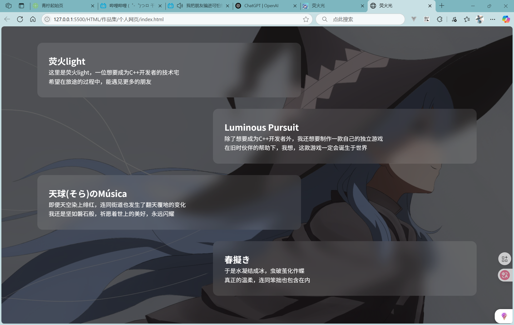
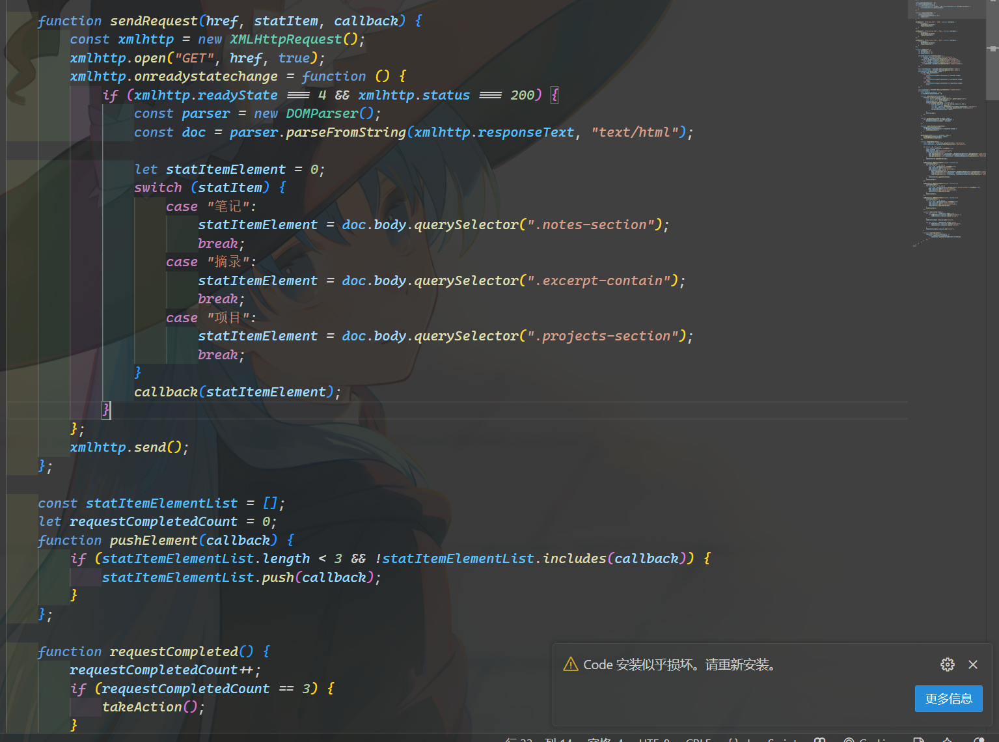
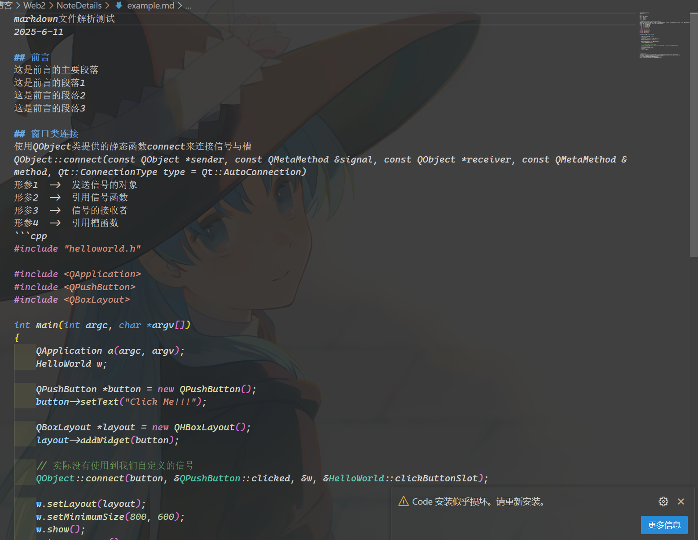

## 想法的诞生
缘于我本人的学习中心并不在于前端，因此很多时候我主动制作的网页都是出于兴趣  
长期以来我的学习重心都是在于研究C++的各种特征，如实现length()函数(不过一直没找到好的解决方法)，继承与多态的底层实现，静态反射...  
因此制作一个个人博客的想法正是因为我想要试一试做一个个人博客，学习一些我未曾涉及的技术  

## 界面的设计
最开始，我的想法是，这个博客需要具备**主页**，**笔记**，**摘录**，**关于**，**留言**  
<mark>主页</mark>页面这一块需要具备统计栏，动态，备忘录，这是主页最基本的组件  
<mark>笔记</mark>页面这一块需要具备统计栏，笔记将以卡片的形式呈现在页面之上，这是笔记最基本的设计  
<mark>摘录</mark>页面主要用来存放一些我喜欢的的语句，或者是我收藏的一些话语，构思这个页面时，我第一时间想到了我之前制作的一个网页中使用到的左右左右的结构，因此我打算延用此做法  

至于关于和留言页面，则没有相关思路  
在真正制作的过程中，我额外添加了项目一页  

### 模块化设计思想
模块化设计思想是一种广泛应用于软件开发和系统设计中的方法论，其核心思想是将复杂的整体系统划分为若干个相对独立，功能明确的模块。每个模块具备清晰的边界与职责，开发者可以根据模块的功能特性和需求，独立进行设计，开发与测试，从而提高系统的可维护性，可复用性与扩展性  
从ver1.0到ver3.0，博客都延续了模块化设计思想  
如博客的文件结构  


### 主题色的确认
我个人喜欢蓝色有关的颜色，但这个页面并不是因为我个人喜欢蓝色，而是缘于我喜欢的一个人物，珂朵莉·诺塔·瑟尼欧里斯  

在初代版本ver1.0中，我并没有将切换主题色作为安排之一  
直到ver3.0，我才加入切换主题色功能  

### 界面的定版
主页需要具有统计栏，动态，备忘录  
笔记需要有统计栏，笔记需要以卡片的形式呈现  
摘录需要左左右右结构  
这些注定了页面的结构以左右方向为主  
最终成品如下(展示的是ver3.0版本的界面)  


## 网页逻辑的设计
### AJAX技术的引入
一开始，我本以为个人博客的实现很简单，只是简单的超链接跳转，然而，并不是，超链接的跳转将导致网页的刷新，而常见的个人博客是更新局部，不会导致整个页面的刷新，这迫使我不得不去寻找新的方法  

我花费了一段时间在网上冲浪，企图寻找一些更有针对性的解决方案  
遗憾的是，大多数教程都是基于框架而非纯JS实现，我并不反对使用框架，但是我制作个人博客的目的是为了学习技术，而非框架的使用  

在B站查询个人博客等相关信息时，我在一个手写个人博客的的视频评论区中找到一个关键词，SPA(单页网页)  
>SPA 是指整个网站只有一个 HTML 页面，所有的页面内容变动、路由跳转、界面更新，都是在这个单一页面中通过 JavaScript 动态实现的。页面不会整体刷新，而是“局部刷新”

毫无疑问，这就是我需要的，SPA页面依赖于AJAX技术来实现局部更新  
>AJAX（Asynchronous JavaScript and XML） 是一种在不重新加载整个页面的情况下，与服务器进行异步通信并动态更新网页内容的技术

通过查阅资料，我学会了如何编写AJAX代码，于是我正式开始编写ver1.0版本的js代码  
ver1.0版本的js代码只是为了实现功能而编写，不考虑整合以及代码结构问题  

我使用AJAX技术，请求本地的html，并使用DOMParser将获取到的字符串进行安全处理，实际上，AJAX技术请求返回的字符串可以直接通过innerHTML插入到网页中，但DOMParser则是可以对其进行一定的安全处理，以此实现了较为安全地将内容插入到页面之中预设的容易，从而实现SPA页面的核心，局部更新    


### 异步编程
在ver1.0中，AJAX技术的引入的确解决了最大的痛点，与此同时，我也遇到了一个特别的问题  
使用AJAX技术读取本地的html文件时，AJAX技术发送的请求是无序的，因此请求得到的结果也是无序的  
这导致我的卡片和预期的顺序不符，迫使我再一次研究AJAX技术  
查阅资料，发现AJAX技术依赖于异步编程  
>异步编程是一种编程范式，用来处理**耗时操作（如网络请求、文件读写、定时任务等）**而不会阻塞程序的主流程。它让程序在等待某个操作完成的同时，能继续执行其他代码，从而提高效率与响应性

异步编程意味着程序可能在未完成请求时就已经执行后续的代码，这会导致后续的代码因为数据不完全而执行失败  

### 回调函数
毫无疑问，我需要处理这个致命的无序问题  
旧时代开发者使用回调函数与唯一索引，以及全局计数器来处理原生AJAX技术的无序问题  
我也沿用了这一种解决方案，我封装了三个函数用于发送请求，全局数组，全局计数  

在ver1.0版本中  
sendRequest()函数用于发起AJAX请求，以此从本地获取数据，在我的js代码中，封装了针对不同页面的sendRequest()函数  
```js
function sendRequest(href, statItem, callback) {
        const xmlhttp = new XMLHttpRequest();
        xmlhttp.open("GET", href, true);
        xmlhttp.onreadystatechange = function () {
            if (xmlhttp.readyState === 4 && xmlhttp.status === 200) {
                const parser = new DOMParser();
                const doc = parser.parseFromString(xmlhttp.responseText, "text/html");

                let statItemElement = 0;
                switch (statItem) {
                    case "笔记":
                        statItemElement = doc.body.querySelector(".notes-section");
                        break;
                    case "摘录":
                        statItemElement = doc.body.querySelector(".excerpt-contain");
                        break;
                    case "项目":
                        statItemElement = doc.body.querySelector(".projects-section");
                        break;
                }
                callback(statItemElement);
            }
        };
        xmlhttp.send();
    };
```
sendRequest()函数的第一个参数href是需要请求的链接  
第二个参数statItem则是获取的卡片的类型  
第三个参数callback则是接受一个函数，以此来将结果存入缓存数组中  
如以下实例  
```js
sendRequest("./HTML/note.html", "笔记", function (callback) {
        if (callback) {
            pushElement(callback);
            requestCompleted();
        }
    });
```

statItemElementList是缓存数组，用来存放AJAX请求返回的结果  
requestCompletedCount是全局计数器，用来统计AJAX请求完成次数，在回调函数中调用requestCompleted()函数来表示请求完成，直到达到预测的数量后触发takeAction()函数，确保在请求完毕之后才执行后续代码  

合乎预料，回调函数与全局计数器的应用解决了目前所遇到的所有问题  

### 清理缓存
在编写笔记页面的js代码时，我发现了一个特别的问题，局部更新会导致原先js所设置的事件监听器失效，这意味着每一次局部更新都需要重新载入一次js文件  
然而，浏览器为了避免重复的资源加载，会对资源进行缓存，因此，每一次加载的文件的文件名都需要与上一次加载的文件名不同，能够时刻发生变化的因素，毫无疑问——**时间戳**  

通过时间戳为每一个文件添加一个唯一的标识，在url中，?v=常用于指定资源的唯一标识符，以此确保每一次局部更新都重载一次js文件  
除此之外，还需要使用IIFE表达式封装js文件，否则会出现变量名重复等问题，需要进行隔离  

### 解析MarkDown
在处理笔记的详情页时，我意识到一个问题，使用html文件作为笔记的详情页很麻烦，需要进行很多重复的操作去编写  
如果使用json存放数据，那么灵活性也没有那么高，有什么是常用的笔记载体呢？  **markdown**  
markdown文件语法简单，功能强大，是许多开发者的笔记载体，而且markdown文件对网页的兼容性很好  
有很多工具能够将markdown文件转换为html，因此markdown文件就是最合适的选择  
只需要通过合适的程序，解析md文件并转换成html代码即可  
于是markDownChangeHtml()函数诞生了  


由于markDown文件本质是纯文本文件，因此AJAX技术能够直接请求md文件并获取其中的内容  
只需要编写一定的程序或者引入marked(?).js解析库解析md文件为html代码即可  



自此，ver1.0版本就此完成，但ver1.0是一个十分具有缺点的版本  
ver1.0的代码过于累赘，并且不易扩展，但仍遵守着模块化设计思想  


### 函数封装与全局库
在ver1.0版本后续的清理与完善工作中，我打算利用函数封装的思想封装通用函数，以此复用函数，减少代码累赘  
为此我将能够复用的函数提取到公共js文件之中  
但是我在设计时发生了失误，我定义了两个回调函数，实际上这是不必要的，这导致代码难以阅读，并险些出现**回调地狱**  


尽管最新的设计解决了代码过于累赘，无法复用的问题，但是不可否认，这是一个失败的设计  

在完善主页的功能时，在展示框中，我想要实现点击后跳转至目标页并滑动至相应的卡片处  
此时，我发现了现版本不足的地方，我能够**读取数据**，但是我并不能**传递数据**  
想要传递数据，就需要有一个全局状态的容器存放这部分数据  
因此有两种做法，一种是history API，还有一种是全局库  
毫无疑问地说，无论是哪一种做法，我都需要重新设计过结构  
想要完成剩余的功能，我必须要重置现有的js结构并实现全局库  

### ES6与模块化设计思想
为了重置现有的结构，我选择拥抱javaScript ES6语法，因为最初我并不打算过多使用现代化语法  
而是使用原生js代码来实现功能，这也是我不使用API的理由  

借助对象与IIFE表达式，我可以实现作用域的隔离，并且实现代码的模块化，扩展性与可复用性相较于之前大大提升  


### JSON
为了适应最新的框架以及更好地满足SPA网页的特征，我决定将数据存放于JSON文件之中，从一开始就加载相关数据  
让所有文件共用这份元数据，并且根据元数据动态生成卡片  


最新的框架允许不同对象中相互调用代码，以此解决了点击主页的卡片后跳转至其他页面并高亮  


最后一块拼图已经被完成，至此ver3.0完成  

### 自定义属性与主题色切换
后续的完善，我利用自定义属性完成主题色切换功能  


```js
_toggleColorBtnInit: function () {
        YhLightApp.indexManager._colorToggleButton().forEach((toggleButton, index) => {
            toggleButton.addEventListener("click", function () {
                YhLightApp.indexManager._root().setAttribute("data-theme-color", YhLightApp.indexManager._themeColor[index])
            })
        });
    }
```

```css
:root {
    --primary-blue: #B6D7E6;
    --light-blue: #DEEAF7;
    --dark-blue: #A4C4D9;
    --background-light: #FAFAFA;
    --text-dark: #333333;
    --border-color: #CAD3E7;
    --shadow-color: rgba(182, 215, 230, 0.2);
}

:root[data-theme-color="sakura"] {
    --primary-blue: rgb(255, 192, 203);
    --light-blue: rgb(255, 228, 235);
    --dark-blue: rgb(255, 166, 174);
    --background-light: rgb(255, 245, 247);
    --text-dark: rgb(34, 34, 34);
    --border-color: rgb(255, 212, 220);
    --shadow-color: rgba(255, 192, 203, 0.2);
}

:root[data-theme-color="violet"] {
    --primary-blue: #B18BE4;
    --light-blue: #E8DAF8;
    --dark-blue: #8B00FF;
    --background-light: #F8F4FC;
    --text-dark: #2E1A47;
    --border-color: #D3B7F0;
    --shadow-color: rgba(177, 139, 228, 0.2);
}
```

### MarkDown解析模块
在博客完成之后，我发现现在的markDownChangeHtml函数局限性很大，这完全就是一个根据我的部分需求而设计的函数，不仅仅局限性很高，而且很多md语法都不支持解析，为此，我有了写解析库的想法    

#### template
对于这个解析库，我的想法是，它带有默认的样式，允许开发者自定义生成的模板  


markDownToHtml: function (markdownContent, onlyContent = false, hasStyle = true, title = null, time = null)  
重置的markDownToHtml()函数的参数控制着如下的行为，onlyContent控制是否包含库预设的容器  
hasStyle控制生成的html代码是否带有默认样式，控制是否触发initStyles()函数，以此将样式注入到页面之中  
title和time则是页面的大标题和时间  

### 网页的部署与服务器配置
在阿里云上获取免费的服务器(Linux)之后，使用Workbench的方式打开  
Workbench方式操作更方便一些  
连接成功后，打开宝塔面板官网，获取其通用安装脚本  

回到Workbench之中，粘贴并执行此命令，等待宝塔面板安装完成  

再安装完成后，宝塔面板会告知服务器需要放行哪个端口，并给出本机宝塔面板的账号与密码，以及访问宝塔面板的链接  
然后在阿里云的服务器设置中的安全组中放行宝塔所提供的端口  

然后通过访问链接访问并登录宝塔  

一键安装选择左侧的LNMP即可  
等待安装的同时，你需要购买域名以及解析域名

#### 域名的解析
在服务器的控制台中，找到服务器的公网IP，复制此IP地址  
然后打开域名的控制台，找到并点击解析域名  
添加记录  

记录类型  ->  A  ->  指向一个IP地址  
主机记录  ->  就是域名的前缀，写www即可，后续需要使用二级域名时，添加一条额外的记录并自定义前缀即可  
解析请求来源  ->  默认  
记录值  ->  记录类型为A时，填入你复制粘贴的公网IP，若记录类型为CNAME时，填写域名    
TTL  ->  默认  

再添加一条记录，过程和上述一致，但是主机记录为@  
确认解析完成后，回到宝塔面板  

#### 添加文件
点击宝塔面板的文件一栏  
回退到根目录，然后www -> server -> nginx -> html  
创建一个文件夹，然后上传你的网页文件到这个文件夹之中  
复制这个路径，例如我的是/www/server/nginx/html/blog  

#### 修改nginx配置文件
点击网站一栏，然后点击反向代理  
点击nginx后会打开nginx配置界面  
点击配置文件  


在http这一块中，一个花括号({})为一块  
添加如下配置  
```nginx
server
    {
        listen 80;
        server_name 域名;
        index index.html index.htm;

        location / {
            root /www/server/nginx/html/blog;
        }
    }
```
保存，然后重载配置，最好是重启一下，有时候热重载会抽风  
完成这部分后，你就可以使用你的域名访问你的网页了  

### js模块加载器
这是后期补充的内容，是对js模块化编程的补充  
在js模块化编程中，模块不可避免地需要相互引用，以此产生了很多依赖问题  
例如初始化优先级等，很多时候都需要手动管理js文件的载入顺序  
有什么办法能够自动管理js文件的载入顺序，使其支持无序载入并能够解决这些依赖问题  
那就是实现模块加载器  

当前网页未使用模块加载器，因此不能作为模块加载器的实例  
简单的模块加载器的框架如下  
```js
    const modules = {};

    function define(name, deps, factory) { }

    function require(name) { }
```
你需要实现define()函数来注册模块  
实现require()函数来处理循环引用以及动态加载模块  

这是一个简单的模块加载器的实现  
```js
(() => {
    // 用于缓存已定义的模块，避免重复注册
    const modules = {};

    /**
     * 定义模块
     * @param {string} name - 模块名称
     * @param {Array<string>} deps - 模块的依赖
     * @param {Function} factory - 模块的工厂函数，用于初始化模块
     */
    function define(name, deps, factory) {
        if (modules[name]) return;

        modules[name] = {
            // deps  ->  模块的依赖
            deps,

            // factory  ->  模块的工厂函数，用于初始化模块
            factory,

            // exports  ->  导出对象，实现模块之间的互联的关键，即模块对外暴露的接口
            exports: {},

            // initialized  ->  模块是否初始化
            initialized: false,
        };
    }

    /**
     * 加载并初始化模块
     * 支持循环依赖，执行模块工厂函数并返回模块导出对象
     * @param {string} name - 要加载的模块名称
     * @returns {*} exports - 模块的导出对象
     */
    function require(name) {
        const mod = modules[name];
        if (!mod) throw new Error(`模块${name}未定义`);
        if (mod.initialized) return mod.exports;

        mod.initialized = true;

        // 模块依赖的导出结果
        const depExports = mod.deps.map(dep => {
            // 注入require()函数，此举是为了动态加载模块或解决循环引用问题
            // 使用define()函数定义模块时，若存在需要手动加载模块或存在循环引用问题时，必须包含require依赖
            // 注意，require依赖仅需要一方拥有即可，其他方无需重复包含，因此被引用次数最多的模块是最优解
            if (dep === "require") return require;
            // 注入当前模块的导出对象
            // 使用define()函数定义模块时，需要向外暴露的模块必须包含有exports依赖
            // require与exports的使用是一种准则
            if (dep === "exports") return mod.exports;
            // 注入当前模块注册信息
            if (dep === "module") return mod;
            // 递归加载其他依赖模块
            return require(dep);
        });

        // 执行工厂函数，传入模块依赖的导出结果
        mod.factory.apply(null, depExports);

        return mod.exports;
    }

    // 将define()与require()函数绑定到全局域中
    window.define = define;
    window.require = require;
})();
```

这是define()函数的应用  
```js
define("UI", ["require", "exports", "Game"], function (require, exports, Game) {
    Object.assign(exports, { });
});
```

```js
define("Game", ["exports", "UI", "GameObject"], function (exports, UI, GameObject) {
    Object.assign(exports, { });
});
```

如你所见UI模块与Game模块明显存在循环引用，这会导致死循环的发生  
而require能够在UI模块与Game模块初始化之前将它们的数据进行导出，从而实现延迟初始化，解决了循环引用问题  

这是应用了模块加载器的js载入顺序  
```html
<script src="./JavaScript/loader.js"></script>
<script src="./JavaScript/app.js"></script>
<script src="./JavaScript/ui.js"></script>
<script src="./JavaScript/game.js"></script>
<script src="./JavaScript/object.js"></script>
<script>
    require("App").init();
</script>
```
显然，在常规情况下肯定是无法正常加载，因为相互引用的问题，必然会发生报错  
但是在模块加载器的处理下，你可以自动管理这些模块的载入，无序考虑顺序问题  
```html
<script src="./JavaScript/loader.js"></script>
<script src="./JavaScript/object.js"></script>
<script src="./JavaScript/ui.js"></script>
<script src="./JavaScript/game.js"></script>
<script src="./JavaScript/app.js"></script>
<script>
    require("App").init();
</script>
```
只要能够保证模块加载器能够导入即可  

如果你想要用更安全的命名空间，你可以仿造如下做法  
```js
((window) => {
    const Louder = {
        // 用于缓存已定义的模块，避免重复注册
        modules: {},

        /**
         * 定义模块
         * @param {string} name - 模块名称
         * @param {Array<string>} deps - 模块的依赖
         * @param {Function} factory - 模块的工厂函数，用于初始化模块
         */
        define: function (name, deps, factory) {
            if (this.modules[name]) return;

            this.modules[name] = {
                // deps  ->  模块的依赖
                deps,

                // factory  ->  模块的工厂函数，用于初始化模块
                factory,

                // exports  ->  导出对象，实现模块之间的互联的关键，即模块对外暴露的接口
                exports: {},

                // initialized  ->  模块是否初始化
                initialized: false,
            };
        },

        /**
         * 加载并初始化模块
         * 支持循环依赖，执行模块工厂函数并返回模块导出对象
         * @param {string} name - 要加载的模块名称
         * @returns {*} exports - 模块的导出对象
         */
        require: function (name) {
            const mod = this.modules[name];
            if (!mod) throw new Error(`模块${name}未定义`);
            if (mod.initialized) return mod.exports;

            mod.initialized = true;

            // 模块依赖的导出结果
            const depExports = mod.deps.map(dep => {
                // 注入require()函数，此举是为了动态加载模块或解决循环引用问题
                // 使用define()函数定义模块时，若存在需要手动加载模块或存在循环引用问题时，必须包含require依赖
                // 注意，require依赖仅需要一方拥有即可，其他方无需重复包含，因此被引用次数最多的模块是最优解
                if (dep === "require") return this.require;
                // 注入当前模块的导出对象
                // 使用define()函数定义模块时，需要向外暴露的模块必须包含有exports依赖
                // require与exports的使用是一种准则
                if (dep === "exports") return mod.exports;
                // 注入当前模块注册信息
                if (dep === "module") return mod;
                // 递归加载其他依赖模块
                return this.require(dep);
            });

            // 执行工厂函数，传入模块依赖的导出结果
            mod.factory.apply(null, depExports);

            return mod.exports;
        }
    }

    window.Louder = Louder;
})(window);
```

-- 至此，完结了(mayBe)  