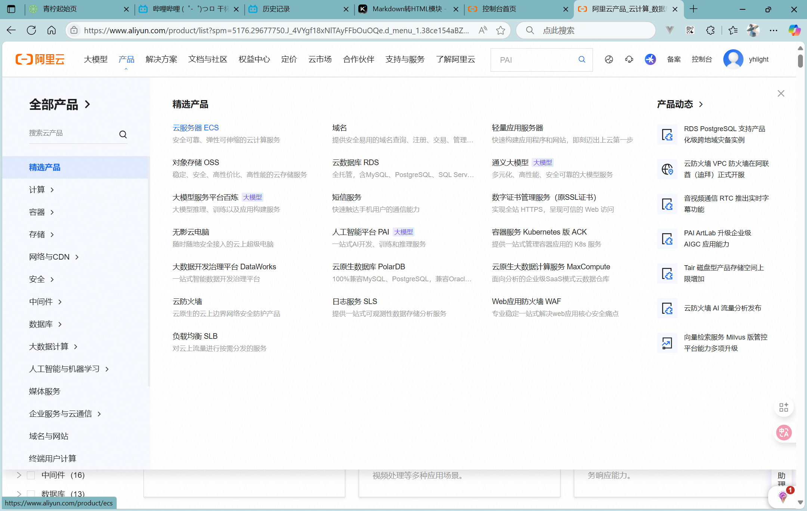
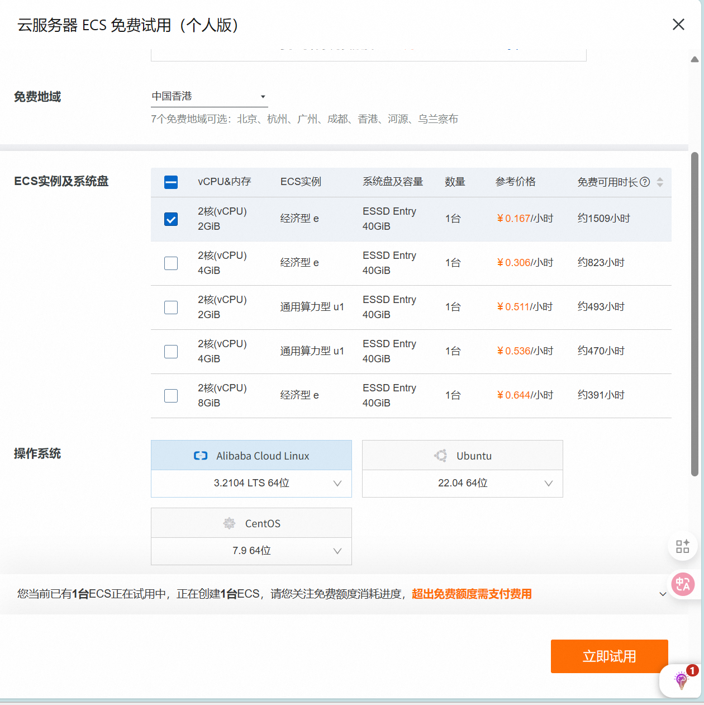
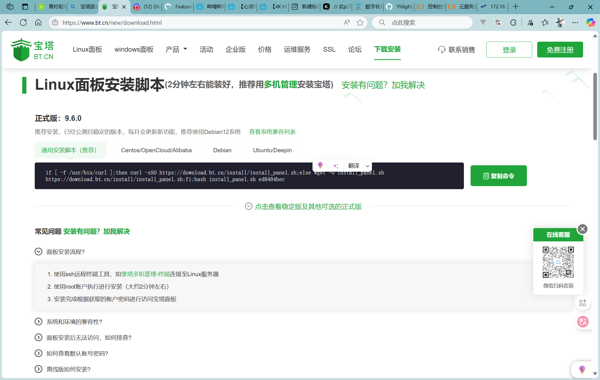
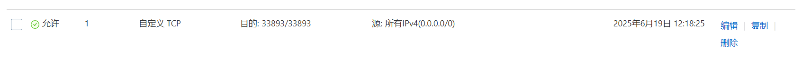
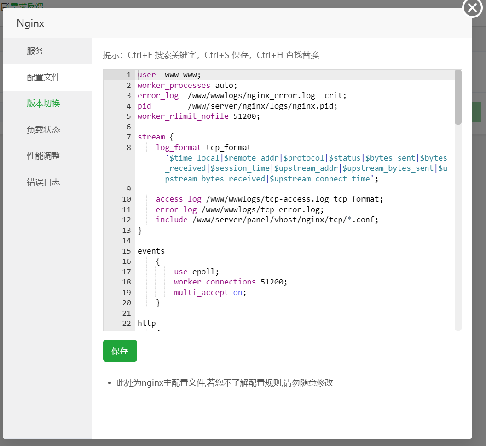

### 服务器的租借
使用阿里云提供的ECS 云服务器服务  


免费试用个人版的ECS 云服务器  

#### 实例的创建
成功使用后，就需要创建相应的ECS实例  
实例建议是使用内地外的地域，这样网页无需备案  


操作系统推荐选Linux，内地默认为Window，你可以点击旁边的Linux选项卡即可切换系统  
如果是内地外的服务器，则默认为Linux，不支持Window  
不要预装软件！！！  

### 网页的部署与服务器配置
在阿里云上获取免费的服务器(Linux)之后，使用Workbench的方式打开  
Workbench方式操作更方便一些  
连接成功后，打开宝塔面板官网，获取其通用安装脚本  

回到Workbench之中，粘贴并执行此命令，等待宝塔面板安装完成  

再安装完成后，宝塔面板会告知服务器需要放行哪个端口，并给出本机宝塔面板的账号与密码，以及访问宝塔面板的链接  
然后在阿里云的服务器设置中的安全组中放行宝塔所提供的端口  

然后通过访问链接访问并登录宝塔  

一键安装选择左侧的LNMP即可  
等待安装的同时，你需要购买域名以及解析域名

#### 域名的解析
在服务器的控制台中，找到服务器的公网IP，复制此IP地址  
然后打开域名的控制台，找到并点击解析域名  
添加记录  

记录类型  ->  A  ->  指向一个IP地址  
主机记录  ->  就是域名的前缀，写www即可，后续需要使用二级域名时，添加一条额外的记录并自定义前缀即可  
解析请求来源  ->  默认  
记录值  ->  记录类型为A时，填入你复制粘贴的公网IP，若记录类型为CNAME时，填写域名    
TTL  ->  默认  

再添加一条记录，过程和上述一致，但是主机记录为@  
确认解析完成后，回到宝塔面板  

#### 添加文件
点击宝塔面板的文件一栏  
回退到根目录，然后www -> server -> nginx -> html  
创建一个文件夹，然后上传你的网页文件到这个文件夹之中  
复制这个路径，例如我的是/www/server/nginx/html/blog  

#### 修改nginx配置文件
点击网站一栏，然后点击反向代理  
点击nginx后会打开nginx配置界面  
点击配置文件  


在http这一块中，一个花括号({})为一块  
添加如下配置  
```nginx
server
    {
        listen 80;
        server_name 域名;
        index index.html index.htm;

        location / {
            root /www/server/nginx/html/blog;
        }
    }
```
保存，然后重载配置，最好是重启一下，有时候热重载会抽风  
完成这部分后，你就可以使用你的域名访问你的网页了  